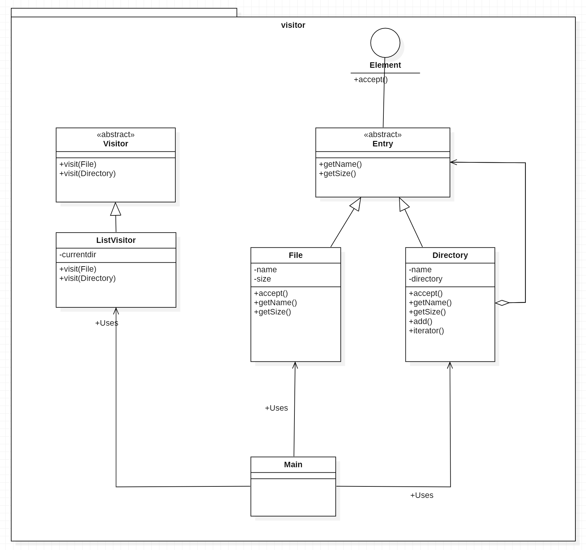
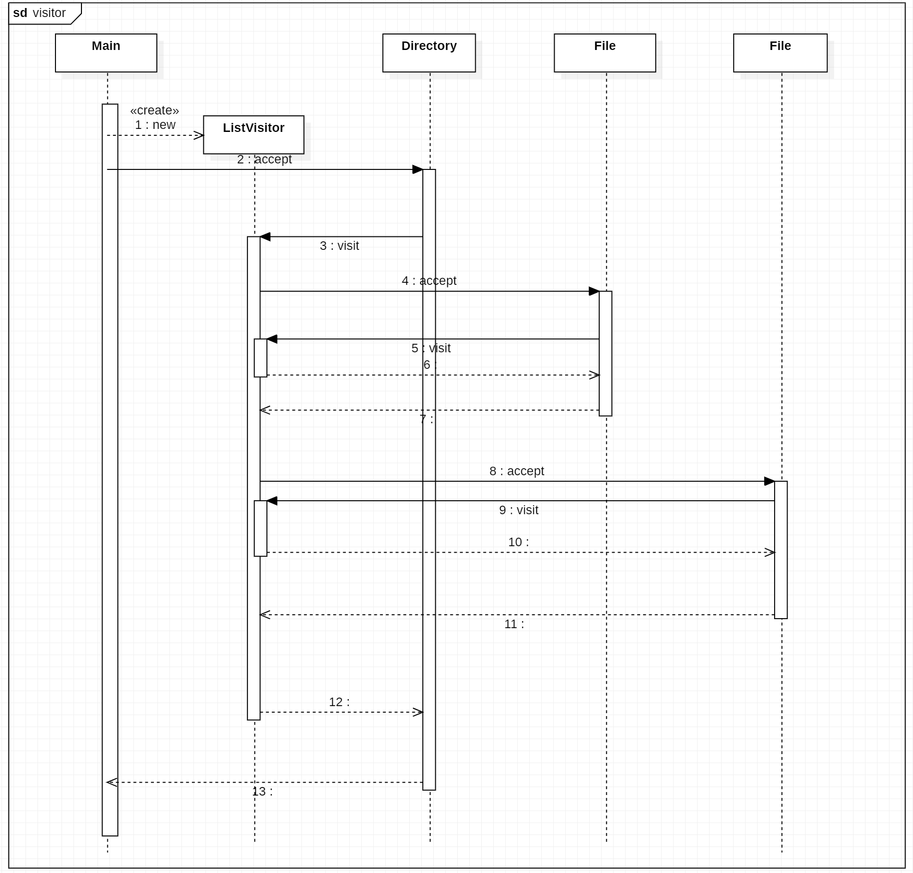

# Visitor 패턴

**Visitor 패턴**은 객체의 구조와 기능을 분리하여 새로운 동작을 기존 객체 구조에 추가할 수 있게 하는 디자인 패턴입니다. 이 패턴은 객체지향 프로그래밍의 SOLID 원칙 중 하나인 "개방-폐쇄 원칙(Open-Closed Principle, OCP)"을 따르며, 기존 코드의 수정 없이 새로운 동작을 추가할 수 있도록 돕습니다. 주로 데이터 구조와 해당 데이터를 처리하는 로직(알고리즘)을 분리해야 할 때 유용하며, 데이터 구조보다 알고리즘이 더 자주 변경될 때 특히 유용합니다.

## 특징

- 객체의 구조와 기능을 분리하여 새로운 동작을 추가하기 쉽게 합니다.
- "개방-폐쇄 원칙(OCP)"을 준수하여 코드 수정을 최소화합니다.
- 데이터 구조와 알고리즘이 분리되어 데이터의 독립성을 높입니다.
- 사용자에게 동일한 인터페이스를 제공하여 코드의 일관성을 유지합니다.

## 장점

- 데이터 구조와 작업 항목을 분리시켜 코드 유지보수를 용이하게 합니다.
- 작업 대상(방문 공간)의 입장에서는 accept()로 인터페이스를 통일시키기 때문에 사용자에게 동일한 인터페이스를 제공할 수 있습니다.

## 단점

- 새로운 작업 대상(방문 공간)이 추가될 때마다 작업 주체(방문자)도 이에 대한 로직을 추가해야 합니다.
- 두 객체(방문자와 방문 공간)의 결합도가 높아질 수 있습니다.

## UML 다이어그램

- **Visitor 클래스:** 방문자를 나타내는 추상 클래스입니다.
- **Element 인터페이스:** 방문자를 받아들이는 인터페이스로, accept 메소드를 선언합니다.
- **Entry 클래스:** 추상 클래스로 디렉토리 엔트리를 표현하며, Element 인터페이스를 실제 구현합니다.
- **File 클래스:** 파일을 표현하는 클래스로, 이름과 크기를 부여해 File 인스턴스를 생성합니다.
- **Directory 클래스:** 디렉토리를 표현하는 클래스로, 이름과 크기를 부여해 Directory 인스턴스를 생성합니다.
- **ListVisitor 클래스:** 데이터 구조를 돌아다니면서 목록을 표시하는 클래스입니다.

## 시퀀스 다이어그램

1. **Main 클래스**가 **ListVisitor의 인스턴스**를 생성합니다.
2. **Main**은 **Directory의 인스턴스**에 대해 `accept` 메소드를 호출합니다.
3. **Directory의 인스턴스**는 인수로 전달된 **ListVisitor의 `visit(Directory)` 메소드**를 호출합니다.
4. **ListVisitor의 인스턴스**는 디렉토리 안을 살펴보고 **첫 번째 파일의 `accept` 메소드**를 호출합니다.
5. **File의 인스턴스**는 인수로 전달된 **ListVisitor의 `visit(File)` 메소드**를 호출합니다.
   (ListVisitor는 여전히 `visit(Directory)`를 실행 중입니다.)
6. `visit(File)`에서 돌아옵니다.
7. `accept`에서 돌아옵니다.
8. **다른 File의 인스턴스의 `accept` 메소드**를 호출합니다.
9. **File의 인스턴스**는 `visit(File)`의 메소드를 호출합니다.
10. 각 메소드의 처리를 완료하고 **마지막에는 Main의 `accept` 메소드 호출 지점**에서도 돌아옵니다.

## 결과

- 파일과 디렉토리로 구성된 데이터 구조 안을 visitor가 돌아다니며 파일 목록을 표시한 결과입니다.